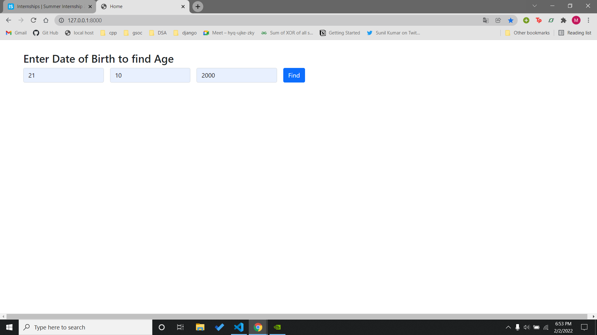
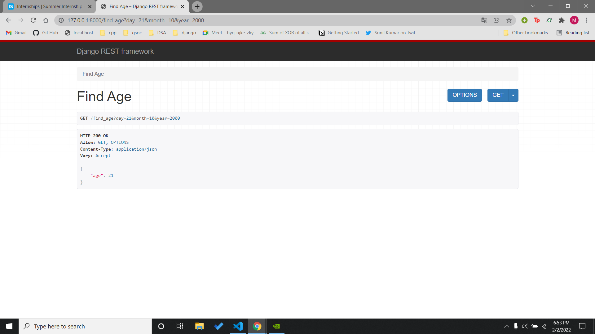

# Assessment

## Question :
Write an HTTP API that takes a day, month, and year as three integer values and returns the age of the person. Use the popular Python web framework & Django to implement the API.

```
Example:
    User Input: 
    Day : 21
    Month : 10
    Year: 2000
    
    Output : 21
```
## Solution:
The api can be found in `api/views`.I have used Django Rest Framework to implement the API.

## How to run 
1. Clone the repo to your local system

    ```git clone https://github.com/manan2110/Assessment.git ```
2. Create a virtual environment. You can use this [link](https://docs.python.org/3/library/venv.html) for reference.

    ``` python -m venv venv ```
3. Activate your virtual environment using : 
    
    ```venv/Scripts/activate``` 
    
    Here venv is the name of virtual environment.

4. Install all the requirements required to run the project : 
    
    ```pip install -r requirements.txt```

5. create a file with name ```.env``` and add the following credentials 
    ``` 
    SECRET_KEY = .....
    DEBUG = ....
    ```
6. To run the script use the command :
    ```python manage.py runserver```

7. Enter the details

## Output :

Input :-


Output:-

